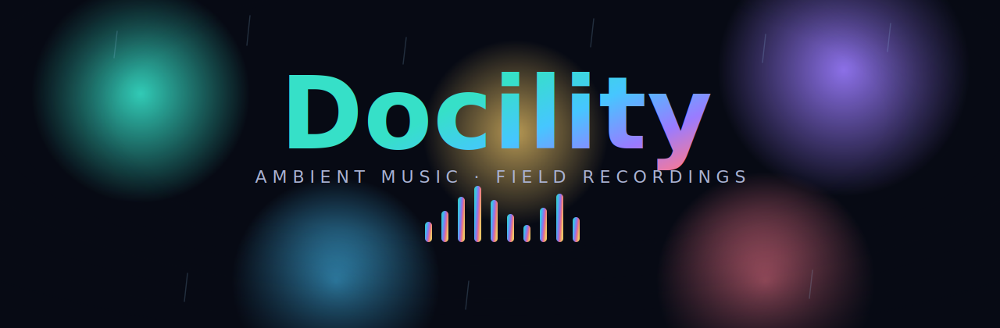

 
 

**Source for [docility.work](https://docility.work)** — the official website for the ambient project _Docility_.

 

 

A single-page, motion-led showcase, hand-built with plain HTML, CSS and JavaScript. 
Albums and EPs · a turntable of current favourites · a scenery filmstrip · the gear behind the sound.

